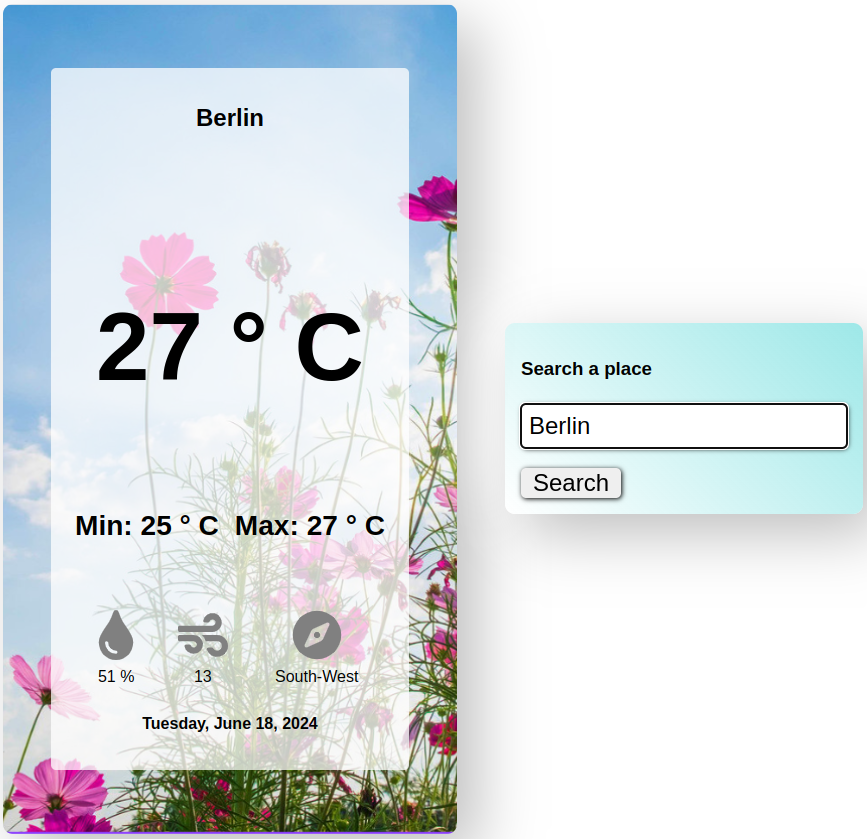
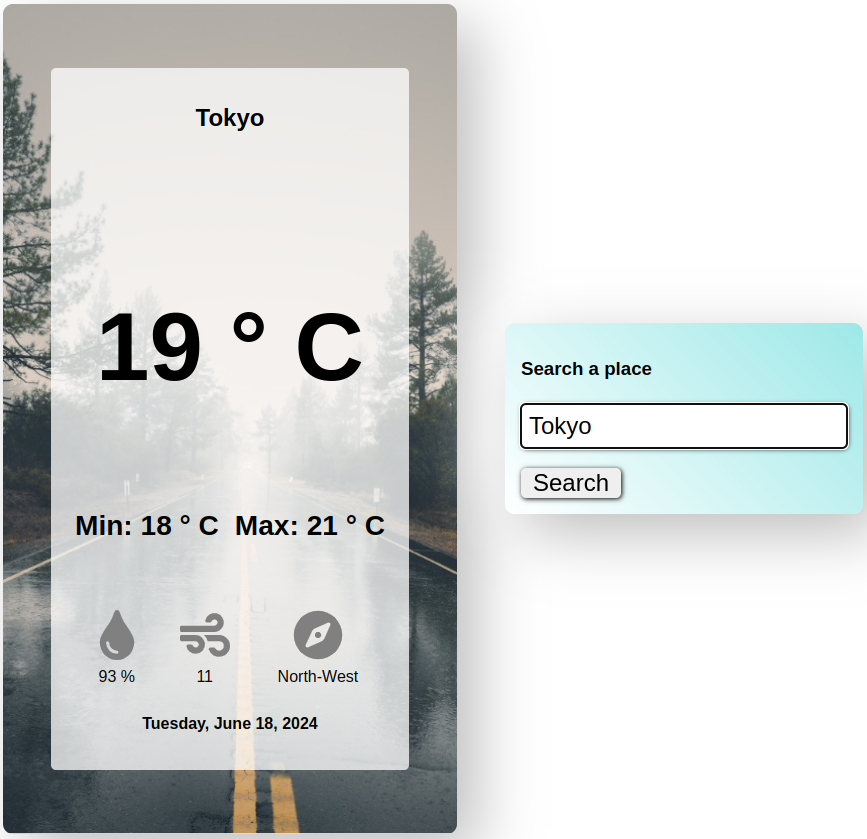
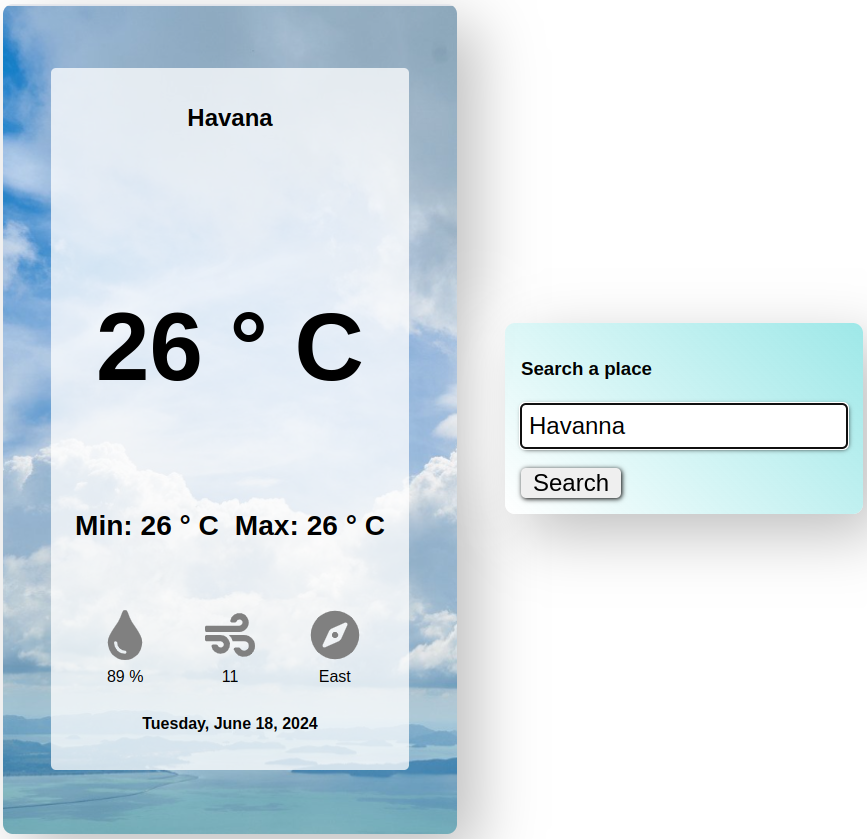

# WeatherApp

WeatherApp is a React application that provides weather information for a specified location. This project was a significant learning experience and my first project using React.

## Overview

In this project, I learned how to make API calls, handle the retrieved data, and display the necessary information. I also learned how to transfer data between components and render them accordingly. Additionally, I explored different ways of adding CSS to components and chose to use CSS modules for better readability and organization. It was a great challenge, and I am very happy to have created a functional application using React.

## Features

- Fetches weather data from the OpenWeatherMap API.
- Displays current weather conditions including temperature, humidity, and description.
- Dynamically changes the background color and icons based on weather conditions.
- Utilizes CSS modules for styling components.

## Lessons Learned

1. **API Calls and Data Handling**: I learned how to make API calls using `fetch`, handle the responses, and manage errors. 
2. **Data Transfer Between Components**: I learned how to pass data between parent and child components using props.
3. **CSS Modules**: I explored different methods of adding CSS to React components and chose CSS modules for their encapsulation and modularity.
4. **Dynamic Class Changes**: I learned how to dynamically change classes of components based on conditions, which allowed me to display different images corresponding to weather conditions.

## Screenshots

### Sunny Weather


### Rainy Weather


### Cloudy Weather


## Installation

1. Clone the repository:
   ```bash
   git clone https://github.com/tu_usuario/tu_repositorio.git

# WeatherApp

WeatherApp is a React application that provides weather information for a specified location. This project was a significant learning experience and my first project using React.

## Overview

In this project, I learned how to make API calls, handle the retrieved data, and display the necessary information. I also learned how to transfer data between components and render them accordingly. Additionally, I explored different ways of adding CSS to components and chose to use CSS modules for better readability and organization. It was a great challenge, and I am very happy to have created a functional application using React.

## Features

- Fetches weather data from the OpenWeatherMap API.
- Displays current weather conditions including temperature, humidity, and description.
- Dynamically changes the background color and icons based on weather conditions.
- Utilizes CSS modules for styling components.

## Lessons Learned

1. **API Calls and Data Handling**: I learned how to make API calls using `fetch`, handle the responses, and manage errors. 
2. **Data Transfer Between Components**: I learned how to pass data between parent and child components using props.
3. **CSS Modules**: I explored different methods of adding CSS to React components and chose CSS modules for their encapsulation and modularity.
4. **Dynamic Class Changes**: I learned how to dynamically change classes of components based on conditions, which allowed me to display different images corresponding to weather conditions.

## Screenshots

### Sunny Weather


### Rainy Weather


### Cloudy Weather


## Installation

1. Clone the repository:
   ```bash
   git clone https://github.com//Hery8910/Weather_App

2. Clone the repository:
      ```bash
   cd Weather_App
      
3. Install dependencies:
      ```bash
   npm install
4. Start the development server:
      ```bash
   npm start

## Usage
1. Open the application in your browser.
2. Enter the name of a city in the input field.
3. Click on "Get Weather" to fetch and display the weather information

## Technologies Used
-React
-JavaScript
-CSS Modules
-OpenWeatherMap API

## Contributing
Contributions are welcome! Please open an issue or submit a pull request for any improvements or bug fixes.
